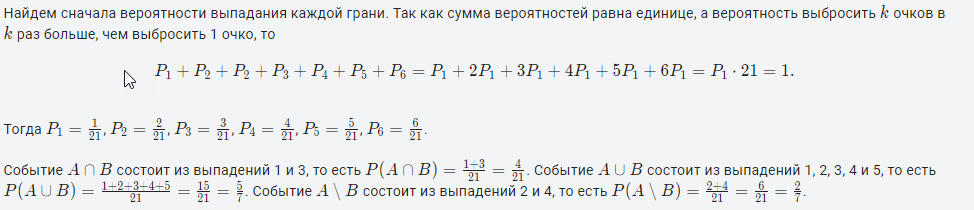
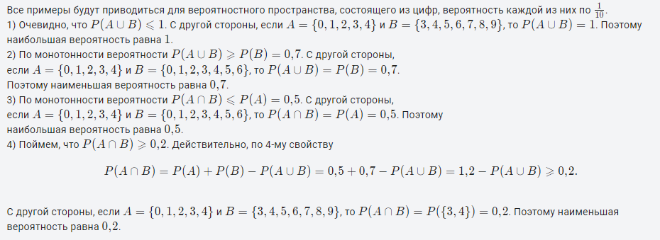

[1.3 Вероятностные пространства](https://stepik.org/lesson/48660/step/1?unit=26431)

### модуль 1.3 шаг 5

Студент, изучающий теорию вероятностей, раздобыл отрывной календарь за 2018 год и вырвал в нем наугад одну страницу. Найдите вероятность того, что число на вырванном листке

* кратно шести;
* равно 30.

В ответе приведите две обыкновенные дроби, разделенные пробелом, например 2/3 3/4.

**Решение**

Среди 365 листков календаря за 2018 год есть по 12 листков с числами 6, 12, 18 и 24. Число 30 написано лишь на 11 листах. Других чисел кратных шести в календаре не бывает. Таким образом,

$$
P_1=\frac{12\cdot4+11}{365}=\frac{59}{365},    P_2=\frac{11}{365}.

$$

**Ответ**

59/365 11/365

### модуль 1.3 шаг 6
У кривого игрального кубика грани помечены числами от **1** до **6**, а вероятность выпадения грани пропорциональна написанному на ней числу. Событие **A** означает, что выпало число, меньшее пяти; событие **B** означает, что выпало нечетное число. Найдите вероятности следующих событий:

* **A**∩**B**
* **A**∪**B**
* **A**∖**B**

В качестве ответа приведите указанные вероятности в виде обыкновенных дробей, разделенных пробелами.

**Решение**

**Ответ**

4/21 5/7 2/7

### модуль 1.3 шаг 7

Пусть события **A** и **B** имеют вероятности **0,5** и **0**,**7** соответственно. Найдите

* Наибольшую вероятность, которую может иметь событие **A**∪**B**;
* Наименьшую вероятность, которую может иметь событие **A**∪**B**;
* Наибольшую вероятность, которую может иметь событие **A**∩**B**;
* Наименьшую вероятность, которую может иметь событие **A**∩**B**.

В качестве ответа приведите указанные вероятности в виде десятичных дробей, разделенных пробелами.

**Решение**

**Ответ**

1.0 0.7 0.5 0.2

### модуль 1.3 шаг 8

Отметьте верные утверждения. Во всех утверждениях **A** и **B** означают случайные события.

**Решение и Ответ**

[x]Если **A**⊂**B**, то **P**(**A**)**⩽**P**(**B**)**

[ ] **P**(**A**∩**B**) **всегда меньше, чем** **P**(**A**)

[x] **P**(**A**∪**B**)**=**P**(**A**)**+**P**(**B**)**−**P**(**A**∩**B**)**

[x] **P**(**A**∩**B**)**⩾**P**(**A**)**+**P**(**B**)**−1**

[x] **P**(**A**∩**B**)**=**P**(**A**∪**B**)**−**P**(**B**)

[ ] Событие**A**∪**B** **означает, что произошло ровно одно из событий** **A** **и** **B**

[x] Событие **A**∩**B** **означает, что произошли оба события** **A** **и** **B**

[x] Если $P(\overline{A}∪\overline{B})=1$ то **P**(**A**∪**B**)=P(**A**)+**P**(**B**)

