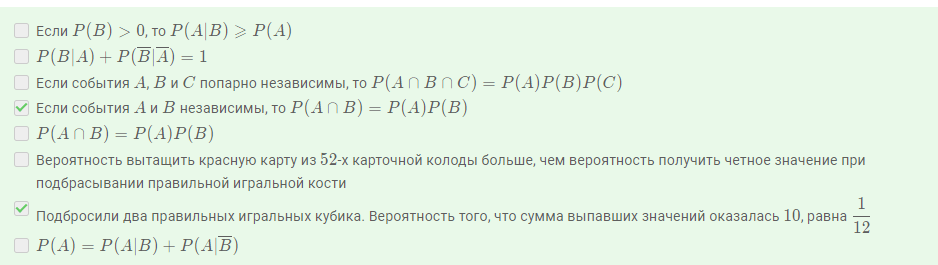
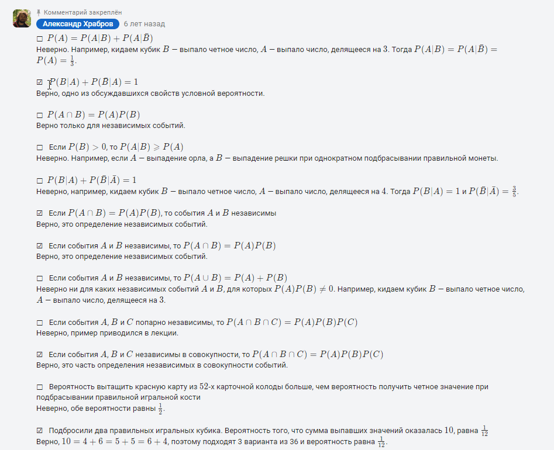

[1.9 Краткие сведения из математического анализа](https://stepik.org/lesson/48666/step/1?unit=26436)

### модуль 1.9 шаг 5

---

Отметьте верные утверждения. Во всех утверждениях **A** и **B** означают случайные события,
а все встречающиеся условные вероятности имеют смысл.

**Решение и ответ**

