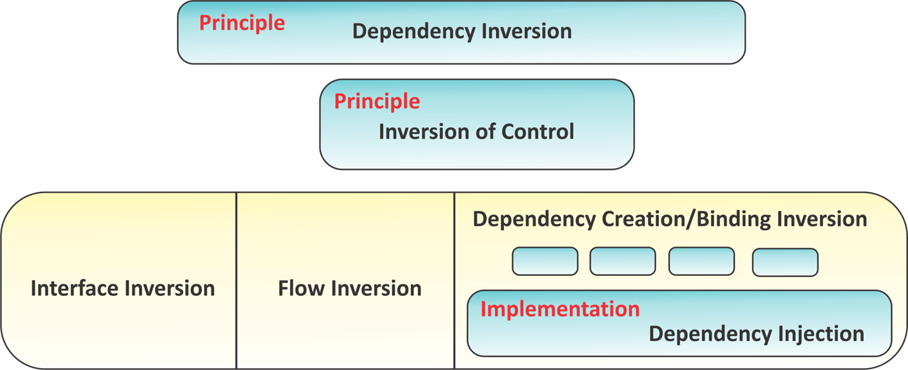
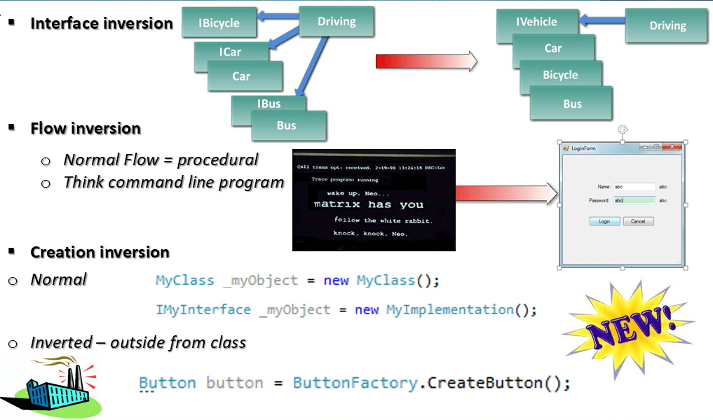
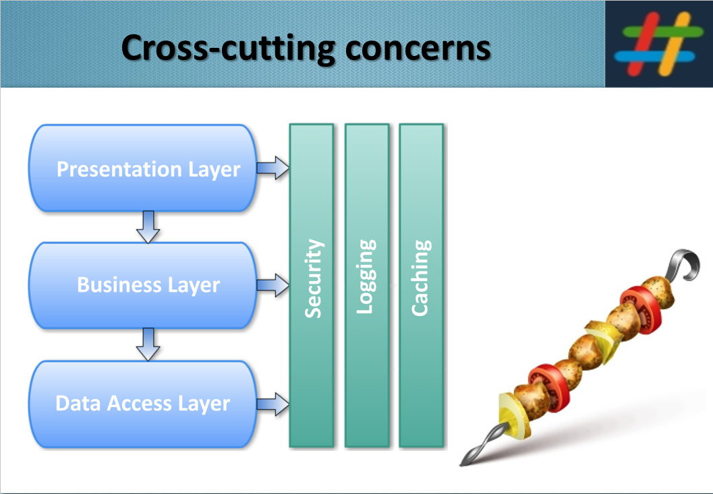

![Dependency Injection & AOP in .NET][image_ref_kdpb7dje]

## Зависимости

Зависимости окружают нас повсюду. Только Господь Бог создал из ничего всё. Люди создают что-то на основе других вещей. Строителю нужны стройматериалы, садовнику — семена, писателю — мысли. Программисты тоже работают с текстом, выражают идеи и воплощают их с помощью кода. По статистике, 90% времени разработчик тратит на чтение чужого и своего кода. Текст — основной материал, та самая глина, из которой каждый из нас ежедневно пытается слепить мысль. У кого-то мысли неуклюжи, у кого-то они получаются почти совершенными (предела совершенству, как известно, нет). Тогда другие программисты могут оценить всю красоту этого словесного шедевра — или карикатуры. Идеального. Почти идеального. Потому что первая и главная зависимость — это сам человек. Его ограниченные возможности, его мыслительные способности и несовершенные черты характера, и всем известные слабости.

Опыт — это череда проб и ошибок. Память о хороших и плохих решениях, а также чутьё, интуиция, которую тоже можно воспитать. И когда программист добавляет новую функциональность — делает выбор: изобретать велосипед или использовать опыт коллег. Всегда хочется создать что-то новое, необычное, нужное. И кажется, что все программы уже написаны (обычно непрограммисты в этом искренне убеждены), всё сделано, всё изобретено и открыто и нет больше места твоим идеям. Но всегда находится кто-то, кто реализует идею и даёт ей долгую жизнь. Этот кто-то, обычно, опережает наши идеи. Кто-то более умный, трудолюбивый и настойчивый постоянно нас опережает.

Мы, обычные программисты, зависим от идей и мыслей. От чужих идей и чужих мыслей. Неохотно, очень неохотно программисты используют чужие идеи. Главным критерием, как, впрочем, и в других областях творчества и ремесла, является красота. Если красиво — значит, скорее всего, правильно.

> «Если код выглядит как говно — скорее всего, он и работает как говно.»  
> — Неизвестный автор

Но каждая новая зависимость, каждая новая компонента, библиотека, сервис, фреймворк, класс или скрипт, добавленные в проект, — увеличивают его сложность. Заставляют зависеть от них, заставляют сталкиваться с неизвестным чужим кодом и чужими мыслями. А нужно, чтобы программа работала. И работала хорошо. И работала хорошо позавчера. (Иногда только получая задание — ты уже опаздываешь с его выполнением). И выглядеть она должна намного лучше. А время? Постоянная зависимость от времени. И нужна кроссбраузерность, кроссплатформенность, кроссвременность и кросс-что-то-там-ещё. Это постоянный кросс на длинную дистанцию самого последнего релиза, самой лучшей, без сомнения, программы.


Зависимость подозрительна. В зависимостях сидят баги, хуже того — чужие баги. Зависимости требуют к себе внимания, как дорогие гости. Нужно уметь выбирать зависимости, нужно тратить время на их обслуживание. Нужно очень быстро учиться, изучая зависимости. Их выбор — искусство, а их влияние на любой проект трудно переоценить.

С другой стороны, хорошие зависимости (а таких очень много) избавляют нас от рутинной работы. Не нужно заново решать уже решённые задачи. Не нужно задумываться над старыми велосипедами, тракторами и бульдозерами. Можно и нужно сосредоточиться над своей задачей. Инженер-конструктор самолётов не начинает постройку истребителя с создания горнодобывающего комбината, не изобретает металлопрокатный станок и не стоит у горна, добывая необходимый алюминий. Чтобы построить самолёт — сложное устройство — необходим исходный материал. Чтобы построить программу — нужны исходные компоненты, строительные блоки. Качественный фундамент — качественный проект. Наиболее успешные проекты используют до 70% заимствованного кода [Гради Буч]. Зависимости определяют будущий проект, и правильное внедрение этих зависимостей является искусством и наукой и мастерством в одном лице. Подробнее о зависимостях, их внедрении и выборе рассмотрим на примере платформы .NET.

---

## Города, которые живут, и города, которые спроектированы

Прежде чем говорить о коде — скажем о городах. Эта аналогия не случайна.

Физик Джеффри Уэст в книге **«Масштаб» (Scale, 2017)** (рекомендую для прочтения всем) открыл эффект масштаба: данные из городов всего мира демонстрируют, что инфраструктура и потребление энергии масштабируются субпропорционально (то есть растут медленнее, чем само население: удвоили город — инфраструктура выросла не в 2 раза, а в 1.8), тогда как показатели социального взаимодействия — суперпропорционально (быстрее, чем население: удвоил город — зарплаты и инновации выросли уже в 2.2 раза). Проще говоря: дороги и трубы растут медленнее населения, зарплаты и инновации — быстрее. Уэст обнаружил универсальные законы роста и самоорганизации, которые управляют живыми системами, городами и компаниями, причём подчиняются они одним и тем же базовым принципам. Города — это самоорганизующиеся сети, а не спроектированные машины.

**Бразилиа** — самый известный контрпример. Столица, спроектированная с нуля в 1956 году учеником Ле Корбюзье Лусио Коста и Оскаром Нимейером — на пустом плато, свободном от балласта трущоб и колониального наследия. Архитектурный шедевр, объект ЮНЕСКО. Но город построен исключительно для автомобиля. Эти огромные пространства не созданы для прогулок. Некоторые утверждают, что Бразилиа не может считаться настоящим городом, потому что в ней отсутствуют необходимые «антропоморфные ингредиенты» — грязные улицы, люди, идущие пешком в соседний офис, стихийные рынки, случайные встречи.

**Что пошло не так?** Всегда что-то не так, правда? Человек планирует, а выходит обычно не очень. Город был спроектирован сверху вниз, исходя из идеологии архитекторов, а не из потребностей жителей. Живой город всегда вырастает из паттернов поведения людей — снизу вверх. Именно это имеет в виду Уэст, когда говорит о самоорганизации: сложность городской жизни не задаётся генеральным планом, а возникает из миллионов мелких взаимодействий.

Это прямая аналогия с разработкой программного обеспечения.


---


## UI как главная зависимость: архитектура снизу вверх

![Under construction — refactoring inevitable](data:image/svg+xml;base64,PHN2ZyB3aWR0aD0iNDAwIiBoZWlnaHQ9IjE4MCIgdmlld0JveD0iMCAwIDQwMCAxODAiIHhtbG5zPSJodHRwOi8vd3d3LnczLm9yZy8yMDAwL3N2ZyI+PHJlY3Qgd2lkdGg9IjQwMCIgaGVpZ2h0PSIxODAiIGZpbGw9IiMyRDM0MzYiIHJ4PSIxMiIvPjxyZWN0IHg9IjAiIHk9IjAiIHdpZHRoPSI0MDAiIGhlaWdodD0iMTgwIiBmaWxsPSJub25lIiBzdHJva2U9IiNGRENCNkUiIHN0cm9rZS13aWR0aD0iMyIgcng9IjEyIi8+PHJlY3QgeD0iMjAiIHk9IjAiIHdpZHRoPSIzMCIgaGVpZ2h0PSIxODAiIGZpbGw9IiNGRENCNkUiIG9wYWNpdHk9IjAuMTUiLz48cmVjdCB4PSI3MCIgeT0iMCIgd2lkdGg9IjMwIiBoZWlnaHQ9IjE4MCIgZmlsbD0iI0ZEQ0I2RSIgb3BhY2l0eT0iMC4wOCIvPjxyZWN0IHg9IjEyMCIgeT0iMCIgd2lkdGg9IjMwIiBoZWlnaHQ9IjE4MCIgZmlsbD0iI0ZEQ0I2RSIgb3BhY2l0eT0iMC4wNSIvPjxwb2x5Z29uIHBvaW50cz0iNjAsMTQ4IDEwMCw1OCAxNDAsMTQ4IiBmaWxsPSIjRkRDQjZFIi8+PHBvbHlnb24gcG9pbnRzPSI3MCwxNDggMTAwLDc0IDEzMCwxNDgiIGZpbGw9IiMyRDM0MzYiLz48dGV4dCB4PSIxMDAiIHk9IjEzNiIgdGV4dC1hbmNob3I9Im1pZGRsZSIgZmlsbD0iI0ZEQ0I2RSIgZm9udC1zaXplPSIzNiIgZm9udC13ZWlnaHQ9ImJvbGQiIGZvbnQtZmFtaWx5PSJtb25vc3BhY2UiPiE8L3RleHQ+PHJlY3QgeD0iMTYwIiB5PSI1NCIgd2lkdGg9IjIyMCIgaGVpZ2h0PSIzNiIgcng9IjYiIGZpbGw9IiNGRENCNkUiLz48dGV4dCB4PSIyNzAiIHk9Ijc5IiB0ZXh0LWFuY2hvcj0ibWlkZGxlIiBmaWxsPSIjMkQzNDM2IiBmb250LXNpemU9IjE1IiBmb250LXdlaWdodD0iYm9sZCIgZm9udC1mYW1pbHk9Im1vbm9zcGFjZSI+VU5ERVIgQ09OU1RSVUNUSU9OPC90ZXh0PjxyZWN0IHg9IjE2MCIgeT0iMTAyIiB3aWR0aD0iMjIwIiBoZWlnaHQ9IjIyIiByeD0iNSIgZmlsbD0ibm9uZSIgc3Ryb2tlPSIjRkRDQjZFIiBzdHJva2Utd2lkdGg9IjEuNSIvPjxyZWN0IHg9IjE2MiIgeT0iMTA0IiB3aWR0aD0iMTAwIiBoZWlnaHQ9IjE4IiByeD0iNCIgZmlsbD0iI0UxNzA1NSIvPjx0ZXh0IHg9IjI3MCIgeT0iMTE3IiB0ZXh0LWFuY2hvcj0ibWlkZGxlIiBmaWxsPSIjRkRDQjZFIiBmb250LXNpemU9IjEwIiBmb250LWZhbWlseT0ibW9ub3NwYWNlIj5yZWZhY3RvcmluZyBpbiBwcm9ncmVzcy4uLjwvdGV4dD48cmVjdCB4PSIxNjAiIHk9IjEzNiIgd2lkdGg9IjIyMCIgaGVpZ2h0PSIxOCIgcng9IjQiIGZpbGw9Im5vbmUiIHN0cm9rZT0iIzYzNkU3MiIgc3Ryb2tlLXdpZHRoPSIxIi8+PHRleHQgeD0iMjcwIiB5PSIxNDkiIHRleHQtYW5jaG9yPSJtaWRkbGUiIGZpbGw9IiM2MzZFNzIiIGZvbnQtc2l6ZT0iOSIgZm9udC1mYW1pbHk9Im1vbm9zcGFjZSI+REItZmlyc3QgdG8gVUktZmlyc3QgbWlncmF0aW9uPC90ZXh0Pjwvc3ZnPg==)


Традиционный подход к разработке: сначала база данных → бизнес-логика → UI. Звучит логично. На практике это Бразилиа: система спроектирована сверху вниз по идеальной схеме, а когда доходит до пользователя — жить в ней неудобно, и приходится переписывать.

Пользовательский интерфейс — это не «слой поверх» архитектуры. **UI — это точка сборки реальных требований.** Именно здесь система встречается с живым пользователем, именно здесь проявляются настоящие паттерны использования. Как в органическом городе улицы прокладываются там, где люди ходят, — а не там, где архитектор провёл линейку.

Марк Шиман описывает типичный антипаттерн: представьте интернет-магазин, где пользовательский интерфейс напрямую взаимодействует с запросами к базе данных. При переходе с SQL на NoSQL придётся переписывать значительные части приложения. Применяя принципы DI, пользовательский интерфейс взаимодействует исключительно через определённые интерфейсы — и при смене базы данных достаточно создать новую реализацию интерфейса доступа к данным, не затрагивая UI-слой [Mark Seemann, *Dependency Injection in .NET*, Manning].

Обратите внимание: сам пример Шимана сформулирован именно от UI. Не «база данных меняется» — а «пользователь работает через UI, который требует гибкости». Это принципиально.

---

### UI-first: что это значит на практике

Традиционный порядок (DB-first, Бразилиа):
```
База данных → Репозитории → Сервисы → API → UI
```

UI-first подход (органический город):
```
User Story → UI Mockup → API contract → Сервисы → Репозитории → БД
```

Это не «нарисовать кнопки первыми». Это значит, что **форма данных и поведение системы определяются запросами пользователя**, а не удобством хранения.

```csharp
// ❌ DB-first: форма данных диктует UI
public class ProductDto
{
    public int ProductId { get; set; }           // из таблицы
    public int CategoryFk { get; set; }           // из схемы БД
    public decimal UnitPriceWithTax { get; set; } // из хранимой процедуры
}

// ✅ UI-first: форма данных отражает потребность пользователя
public class ProductCardViewModel
{
    public string Name { get; set; }
    public string FormattedPrice { get; set; }   // "$12.99"
    public string CategoryLabel { get; set; }    // "Electronics"
    public bool IsAvailable { get; set; }
    public string[] Tags { get; set; }
}
```

Именно поэтому DI критически важен: он позволяет строить систему в любом направлении, не привязываясь к конкретным реализациям на ранних этапах.

---

## Принцип инверсии зависимостей (DIP)


![dependency inversion principle][image_ref_9s8wk88q =250x]

**DIP (Dependency Inversion Principle)** — один из пяти принципов SOLID:

- Модули высокого уровня не должны зависеть от модулей низкого уровня. Оба должны зависеть от абстракций.
- Абстракции не должны зависеть от деталей. Детали должны зависеть от абстракций.

> [Agile Principles, Practices and Patterns in C#]

```csharp
// ❌ Нарушение DIP: высокоуровневый класс зависит от конкретной реализации
public class OrderService
{
    private readonly SqlOrderRepository _repository = new SqlOrderRepository();
}

// ✅ Соблюдение DIP: зависимость от абстракции
public class OrderService
{
    private readonly IOrderRepository _repository;

    public OrderService(IOrderRepository repository)
    {
        _repository = repository;
    }
}
```

---

## Dependency Injection & IoC

 

> «"Dependency Injection" — это дорогой термин для дешёвой идеи. Внедрение зависимостей означает передачу объекту его переменных экземпляра. Вот и всё.»  
> — James Shore

**Dependency Injection** — это набор принципов и паттернов проектирования, которые позволяют разрабатывать слабосвязанный код.
> — Mark Seemann

**Inversion of Control (IoC)** — паттерн для инверсии интерфейсов, потоков и зависимостей.
> — John Sonmez

**IoC Container** — фреймворк для внедрения зависимостей.
<img src="data:image/svg+xml;base64,PHN2ZyB3aWR0aD0iNDAwIiBoZWlnaHQ9IjI2MCIgdmlld0JveD0iMCAwIDQwMCAyNjAiIHhtbG5zPSJodHRwOi8vd3d3LnczLm9yZy8yMDAwL3N2ZyI+PHJlY3Qgd2lkdGg9IjQwMCIgaGVpZ2h0PSIyNjAiIGZpbGw9IiNGOEY5RkYiLz48bGluZSB4MT0iNjAiIHkxPSIzNiIgeDI9IjQyIiB5Mj0iMTE2IiBzdHJva2U9IiM3NEI5RkYiIHN0cm9rZS13aWR0aD0iMS41IiBvcGFjaXR5PSIwLjYiLz48bGluZSB4MT0iNjAiIHkxPSIzNiIgeDI9IjEzMCIgeTI9IjExNiIgc3Ryb2tlPSIjNzRCOUZGIiBzdHJva2Utd2lkdGg9IjEuNSIgb3BhY2l0eT0iMC42Ii8+PGxpbmUgeDE9IjYwIiB5MT0iMzYiIHgyPSIyNTIiIHkyPSIxMTYiIHN0cm9rZT0iIzc0QjlGRiIgc3Ryb2tlLXdpZHRoPSIxLjUiIG9wYWNpdHk9IjAuNiIvPjxsaW5lIHgxPSI2MCIgeTE9IjM2IiB4Mj0iNjIiIHkyPSIyMDAiIHN0cm9rZT0iIzc0QjlGRiIgc3Ryb2tlLXdpZHRoPSIxLjUiIG9wYWNpdHk9IjAuNSIvPjxsaW5lIHgxPSIyMDAiIHkxPSIzNiIgeDI9IjQyIiB5Mj0iMTE2IiBzdHJva2U9IiNGRjc2NzUiIHN0cm9rZS13aWR0aD0iMS41IiBvcGFjaXR5PSIwLjYiLz48bGluZSB4MT0iMjAwIiB5MT0iMzYiIHgyPSIxMzAiIHkyPSIxMTYiIHN0cm9rZT0iI0ZGNzY3NSIgc3Ryb2tlLXdpZHRoPSIxLjUiIG9wYWNpdHk9IjAuNiIvPjxsaW5lIHgxPSIyMDAiIHkxPSIzNiIgeDI9IjM1MiIgeTI9IjExNiIgc3Ryb2tlPSIjRkY3Njc1IiBzdHJva2Utd2lkdGg9IjEuNSIgb3BhY2l0eT0iMC42Ii8+PGxpbmUgeDE9IjIwMCIgeTE9IjM2IiB4Mj0iMjAyIiB5Mj0iMjAwIiBzdHJva2U9IiNGRjc2NzUiIHN0cm9rZS13aWR0aD0iMS41IiBvcGFjaXR5PSIwLjUiLz48bGluZSB4MT0iMzQwIiB5MT0iMzYiIHgyPSIxMzAiIHkyPSIxMTYiIHN0cm9rZT0iIzU1RUZDNCIgc3Ryb2tlLXdpZHRoPSIxLjUiIG9wYWNpdHk9IjAuNiIvPjxsaW5lIHgxPSIzNDAiIHkxPSIzNiIgeDI9IjI1MiIgeTI9IjExNiIgc3Ryb2tlPSIjNTVFRkM0IiBzdHJva2Utd2lkdGg9IjEuNSIgb3BhY2l0eT0iMC42Ii8+PGxpbmUgeDE9IjM0MCIgeTE9IjM2IiB4Mj0iMzUyIiB5Mj0iMTE2IiBzdHJva2U9IiM1NUVGQzQiIHN0cm9rZS13aWR0aD0iMS41IiBvcGFjaXR5PSIwLjYiLz48bGluZSB4MT0iMzQwIiB5MT0iMzYiIHgyPSIzNDIiIHkyPSIyMDAiIHN0cm9rZT0iIzU1RUZDNCIgc3Ryb2tlLXdpZHRoPSIxLjUiIG9wYWNpdHk9IjAuNSIvPjxsaW5lIHgxPSI0MiIgeTE9IjE0NCIgeDI9IjYyIiB5Mj0iMjAwIiBzdHJva2U9IiNBMjlCRkUiIHN0cm9rZS13aWR0aD0iMS41IiBvcGFjaXR5PSIwLjYiLz48bGluZSB4MT0iMTMwIiB5MT0iMTQ0IiB4Mj0iMjAyIiB5Mj0iMjAwIiBzdHJva2U9IiNGRENCNkUiIHN0cm9rZS13aWR0aD0iMS41IiBvcGFjaXR5PSIwLjYiLz48bGluZSB4MT0iMjUyIiB5MT0iMTQ0IiB4Mj0iNjIiIHkyPSIyMDAiIHN0cm9rZT0iIzAwQ0VDOSIgc3Ryb2tlLXdpZHRoPSIxLjUiIG9wYWNpdHk9IjAuNSIvPjxsaW5lIHgxPSIzNTIiIHkxPSIxNDQiIHgyPSIzNDIiIHkyPSIyMDAiIHN0cm9rZT0iI0ZGNzY3NSIgc3Ryb2tlLXdpZHRoPSIxLjUiIG9wYWNpdHk9IjAuNiIvPjxsaW5lIHgxPSIyMDAiIHkxPSIzNiIgeDI9IjYyIiB5Mj0iMjAwIiBzdHJva2U9IiNGRjc2NzUiIHN0cm9rZS13aWR0aD0iMSIgc3Ryb2tlLWRhc2hhcnJheT0iMywzIiBvcGFjaXR5PSIwLjQiLz48bGluZSB4MT0iNjAiIHkxPSIzNiIgeDI9IjM0MiIgeTI9IjIwMCIgc3Ryb2tlPSIjNzRCOUZGIiBzdHJva2Utd2lkdGg9IjEiIHN0cm9rZS1kYXNoYXJyYXk9IjMsMyIgb3BhY2l0eT0iMC40Ii8+PGxpbmUgeDE9IjQyIiB5MT0iMTQ0IiB4Mj0iMjAyIiB5Mj0iMjAwIiBzdHJva2U9IiNBMjlCRkUiIHN0cm9rZS13aWR0aD0iMSIgc3Ryb2tlLWRhc2hhcnJheT0iMywzIiBvcGFjaXR5PSIwLjQiLz48cmVjdCB4PSIyOCIgeT0iMjAiIHdpZHRoPSI2NCIgaGVpZ2h0PSIzMiIgcng9IjgiIGZpbGw9IiM3NEI5RkYiLz48dGV4dCB4PSI2MCIgeT0iNDEiIHRleHQtYW5jaG9yPSJtaWRkbGUiIGZpbGw9IndoaXRlIiBmb250LXNpemU9IjExIiBmb250LWZhbWlseT0ic2Fucy1zZXJpZiIgZm9udC13ZWlnaHQ9IjUwMCI+VXNlclN2YzwvdGV4dD48cmVjdCB4PSIxNjYiIHk9IjIwIiB3aWR0aD0iNjgiIGhlaWdodD0iMzIiIHJ4PSI4IiBmaWxsPSIjRkY3Njc1Ii8+PHRleHQgeD0iMjAwIiB5PSI0MSIgdGV4dC1hbmNob3I9Im1pZGRsZSIgZmlsbD0id2hpdGUiIGZvbnQtc2l6ZT0iMTEiIGZvbnQtZmFtaWx5PSJzYW5zLXNlcmlmIiBmb250LXdlaWdodD0iNTAwIj5PcmRlclN2YzwvdGV4dD48cmVjdCB4PSIzMDYiIHk9IjIwIiB3aWR0aD0iNjgiIGhlaWdodD0iMzIiIHJ4PSI4IiBmaWxsPSIjNTVFRkM0Ii8+PHRleHQgeD0iMzQwIiB5PSI0MSIgdGV4dC1hbmNob3I9Im1pZGRsZSIgZmlsbD0iIzJEMzQzNiIgZm9udC1zaXplPSIxMSIgZm9udC1mYW1pbHk9InNhbnMtc2VyaWYiIGZvbnQtd2VpZ2h0PSI1MDAiPlBheVN2YzwvdGV4dD48cmVjdCB4PSIxNCIgeT0iMTEyIiB3aWR0aD0iNTYiIGhlaWdodD0iMjgiIHJ4PSI3IiBmaWxsPSIjQTI5QkZFIi8+PHRleHQgeD0iNDIiIHk9IjEzMSIgdGV4dC1hbmNob3I9Im1pZGRsZSIgZmlsbD0id2hpdGUiIGZvbnQtc2l6ZT0iMTAiIGZvbnQtZmFtaWx5PSJzYW5zLXNlcmlmIj5BdXRoU3ZjPC90ZXh0PjxyZWN0IHg9IjEwMCIgeT0iMTEyIiB3aWR0aD0iNjAiIGhlaWdodD0iMjgiIHJ4PSI3IiBmaWxsPSIjRkRDQjZFIi8+PHRleHQgeD0iMTMwIiB5PSIxMzEiIHRleHQtYW5jaG9yPSJtaWRkbGUiIGZpbGw9IiMyRDM0MzYiIGZvbnQtc2l6ZT0iMTAiIGZvbnQtZmFtaWx5PSJzYW5zLXNlcmlmIj5DYWNoZVN2YzwvdGV4dD48cmVjdCB4PSIyMjIiIHk9IjExMiIgd2lkdGg9IjYwIiBoZWlnaHQ9IjI4IiByeD0iNyIgZmlsbD0iIzAwQ0VDOSIvPjx0ZXh0IHg9IjI1MiIgeT0iMTMxIiB0ZXh0LWFuY2hvcj0ibWlkZGxlIiBmaWxsPSJ3aGl0ZSIgZm9udC1zaXplPSIxMCIgZm9udC1mYW1pbHk9InNhbnMtc2VyaWYiPkxvZ1N2YzwvdGV4dD48cmVjdCB4PSIzMjAiIHk9IjExMiIgd2lkdGg9IjY0IiBoZWlnaHQ9IjI4IiByeD0iNyIgZmlsbD0iI0ZGNzY3NSIvPjx0ZXh0IHg9IjM1MiIgeT0iMTMxIiB0ZXh0LWFuY2hvcj0ibWlkZGxlIiBmaWxsPSJ3aGl0ZSIgZm9udC1zaXplPSIxMCIgZm9udC1mYW1pbHk9InNhbnMtc2VyaWYiPkVtYWlsU3ZjPC90ZXh0PjxyZWN0IHg9IjI4IiB5PSIxOTYiIHdpZHRoPSI2OCIgaGVpZ2h0PSIyOCIgcng9IjciIGZpbGw9IiM2MzZFNzIiLz48dGV4dCB4PSI2MiIgeT0iMjE1IiB0ZXh0LWFuY2hvcj0ibWlkZGxlIiBmaWxsPSJ3aGl0ZSIgZm9udC1zaXplPSIxMCIgZm9udC1mYW1pbHk9InNhbnMtc2VyaWYiPkRhdGFiYXNlPC90ZXh0PjxyZWN0IHg9IjE2NiIgeT0iMTk2IiB3aWR0aD0iNjgiIGhlaWdodD0iMjgiIHJ4PSI3IiBmaWxsPSIjNjM2RTcyIi8+PHRleHQgeD0iMjAwIiB5PSIyMTUiIHRleHQtYW5jaG9yPSJtaWRkbGUiIGZpbGw9IndoaXRlIiBmb250LXNpemU9IjEwIiBmb250LWZhbWlseT0ic2Fucy1zZXJpZiI+UmVkaXM8L3RleHQ+PHJlY3QgeD0iMzA4IiB5PSIxOTYiIHdpZHRoPSI2OCIgaGVpZ2h0PSIyOCIgcng9IjciIGZpbGw9IiM2MzZFNzIiLz48dGV4dCB4PSIzNDIiIHk9IjIxNSIgdGV4dC1hbmNob3I9Im1pZGRsZSIgZmlsbD0id2hpdGUiIGZvbnQtc2l6ZT0iMTAiIGZvbnQtZmFtaWx5PSJzYW5zLXNlcmlmIj5RdWV1ZTwvdGV4dD48dGV4dCB4PSIyMDAiIHk9IjI0OCIgdGV4dC1hbmNob3I9Im1pZGRsZSIgZmlsbD0iIzYzNkU3MiIgZm9udC1zaXplPSIxMSIgZm9udC1mYW1pbHk9InNhbnMtc2VyaWYiPkltcGxpY2l0IGRlcGVuZGVuY2llcyDigJQgc3BhZ2hldHRpIGFyY2hpdGVjdHVyZTwvdGV4dD48L3N2Zz4="  width="400"/>


### Типы зависимостей

| Тип | Примеры |
|-----|---------|
| **Явные (public)** | Параметры конструктора, свойства |
| **Неявные (hidden)** | `new SomeService()`, статические методы, синглтоны |
| **Внутренние** | Бизнес-логика, доменные объекты |
| **Внешние** | БД, файловая система, веб-сервисы, сторонние библиотеки |
| **Базовые** | Фреймворк, runtime, ОС |
| **Современные (2025)** | AI/LLM сервисы, облачные провайдеры, feature flags, language models |

---

## Паттерны внедрения зависимостей

### 1. Constructor Injection (рекомендуется)

```csharp
public class PaymentService
{
    private readonly IPaymentGateway _gateway;
    private readonly ILogger<PaymentService> _logger;

    public PaymentService(IPaymentGateway gateway, ILogger<PaymentService> logger)
    {
        _gateway = gateway ?? throw new ArgumentNullException(nameof(gateway));
        _logger = logger;
    }

    public async Task<PaymentResult> ProcessAsync(PaymentRequest request)
    {
        _logger.LogInformation("Processing payment {Id}", request.Id);
        return await _gateway.ChargeAsync(request);
    }
}
```

### 2. Property Injection (опционально, с локальными дефолтами)

```csharp
public class ReportService
{
    // Опциональная зависимость — работает и без внешней инъекции
    public ILogger Logger { get; set; } = NullLogger.Instance;

    public void Generate(Report report)
    {
        Logger.LogInformation("Generating report: {Name}", report.Name);
    }
}
```

### 3. Method Injection (зависимость меняется с каждым вызовом)

```csharp
public class DataProcessor
{
    // transformer варьируется в зависимости от контекста вызова
    public void Process(IDataSet dataSet, ITransformer transformer)
    {
        var result = transformer.Transform(dataSet);
    }
}
```

### 4. Factory Injection

```csharp
public class NotificationService
{
    private readonly Func<NotificationType, INotifier> _notifierFactory;

    public NotificationService(Func<NotificationType, INotifier> notifierFactory)
        => _notifierFactory = notifierFactory;

    public void Notify(NotificationType type, string message)
        => _notifierFactory(type).Send(message);
}
```

---

## Инверсия управления (IoC)




Три вида инверсии:

| Вид инверсии | Описание |
|---|---|
| **Interface Inversion** | Контроль над интерфейсом между двумя компонентами |
| **Flow Inversion** | Контроль над потоком выполнения (Event-driven, Hollywood Principle) |
| **Creation Inversion** | Контроль над созданием и связыванием зависимостей |

### IoC-контейнер в .NET 8+

```csharp
// Program.cs
var builder = WebApplication.CreateBuilder(args);

builder.Services.AddScoped<IOrderService, OrderService>();
builder.Services.AddSingleton<ICache, MemoryCache>();
builder.Services.AddTransient<IEmailSender, SmtpEmailSender>();

// Современные зависимости
builder.Services.AddOpenAIClient(builder.Configuration["OpenAI:ApiKey"]);
builder.Services.AddAzureBlobStorage(builder.Configuration["Azure:Storage"]);
builder.Services.AddFeatureManagement();

var app = builder.Build();
```

### Паттерн Register → Resolve → Release

```
┌─────────────┐    ┌─────────────┐    ┌─────────────┐
│  REGISTER   │───▶│   RESOLVE   │───▶│   RELEASE   │
│             │    │             │    │             │
│ Настройка   │    │ Получение   │    │ Освобождение│
│ контейнера  │    │ зависимост. │    │ ресурсов    │
└─────────────┘    └─────────────┘    └─────────────┘
```

> **Hollywood Principle:** «Не звони в контейнер — он позвонит тебе сам.»

### Современные IoC-фреймворки (.NET)

| IoC-фреймворк | Преимущества | Недостатки |
|---|---|---|
| **Microsoft.Extensions.DI** | Встроен в .NET, официальная поддержка | Минималистичный API |
| **Autofac** | Гибкий API, модули, декораторы | Немного сложнее в освоении |
| **Scrutor** | Конвенционная регистрация поверх MS DI | Зависит от MS DI |
| **Castle Windsor** | Полный, поддержка декораторов, типизированные фабрики | Местами quirky API |
| **Ninject** | Лёгкий, расширяемый | Медленная производительность |

> **2025:** Для большинства проектов на .NET 8+ достаточно встроенного контейнера + `Scrutor` для конвенционной регистрации.

---

## Сквозная функциональность (Cross-cutting Concerns)




Сквозная функциональность — это поведение, затрагивающее множество компонентов, но не являющееся частью их основной ответственности.

| Аспект | Описание |
|---|---|
| **Logging** | Запись событий о состоянии приложения |
| **Auditing** | Мониторинг важных операций и данных |
| **Caching** | Повышение производительности через кеширование |
| **Security** | Авторизация и аутентификация |
| **Error Handling** | Перехват и обработка исключений |
| **Fault Tolerance** | Circuit Breaker, Retry, Timeout |
| **Performance Counting** | Диагностика производительности |
| **Distributed Tracing** | OpenTelemetry — современная замена простому логированию |

---

## AOP & Aspects


**Aspect-oriented programming (AOP)** — подход к программированию, который позволяет глобальным свойствам программы определять, как она компилируется в исполняемую программу.

**Аспект** — подпрограмма, связанная с конкретным свойством программы. При изменении этого свойства эффект «расходится» по всей программе. Аспект используется как часть нового вида компилятора — **aspect weaver**.

Ключевые принципы, на которых строится AOP:
- Wrapper / обёртка
- Single Responsibility Principle
- Decorator Pattern
- Open/Closed Principle

---

## AOP → Middleware: современный подход

В 2025 году большинство задач AOP решается через **Middleware Pipeline** (ASP.NET Core), **Decorator Pattern**, **Behaviors** (MediatR) и **Interceptors**. PostSharp-подход с IL Weaving актуален для специфических случаев.

### ASP.NET Core Middleware Pipeline

```csharp
public class RequestLoggingMiddleware
{
    private readonly RequestDelegate _next;
    private readonly ILogger<RequestLoggingMiddleware> _logger;

    public RequestLoggingMiddleware(RequestDelegate next, ILogger<RequestLoggingMiddleware> logger)
    {
        _next = next;
        _logger = logger;
    }

    public async Task InvokeAsync(HttpContext context)
    {
        var sw = Stopwatch.StartNew();
        _logger.LogInformation("→ {Method} {Path}", context.Request.Method, context.Request.Path);
        try
        {
            await _next(context);
        }
        finally
        {
            sw.Stop();
            _logger.LogInformation("← {Status} {Path} [{Elapsed}ms]",
                context.Response.StatusCode, context.Request.Path, sw.ElapsedMilliseconds);
        }
    }
}

app.UseMiddleware<RequestLoggingMiddleware>();
```

### Декоратор — универсальный AOP без магии

```csharp
public interface IProductRepository
{
    Task<Product?> GetByIdAsync(int id);
}

public class EfProductRepository : IProductRepository
{
    private readonly AppDbContext _db;
    public EfProductRepository(AppDbContext db) => _db = db;
    public Task<Product?> GetByIdAsync(int id) => _db.Products.FindAsync(id).AsTask();
}

// Декоратор кеширования — AOP без PostSharp
public class CachedProductRepository : IProductRepository
{
    private readonly IProductRepository _inner;
    private readonly IMemoryCache _cache;

    public CachedProductRepository(IProductRepository inner, IMemoryCache cache)
    {
        _inner = inner;
        _cache = cache;
    }

    public Task<Product?> GetByIdAsync(int id)
        => _cache.GetOrCreateAsync($"product:{id}", _ => _inner.GetByIdAsync(id));
}

// Регистрация с Scrutor
services.AddScoped<IProductRepository, EfProductRepository>();
services.Decorate<IProductRepository, CachedProductRepository>();
```

### MediatR Pipeline Behaviors (CQRS + AOP)

```csharp
public class LoggingBehavior<TRequest, TResponse> : IPipelineBehavior<TRequest, TResponse>
    where TRequest : IRequest<TResponse>
{
    private readonly ILogger<LoggingBehavior<TRequest, TResponse>> _logger;

    public LoggingBehavior(ILogger<LoggingBehavior<TRequest, TResponse>> logger)
        => _logger = logger;

    public async Task<TResponse> Handle(
        TRequest request,
        RequestHandlerDelegate<TResponse> next,
        CancellationToken cancellationToken)
    {
        var name = typeof(TRequest).Name;
        _logger.LogInformation("[START] {Request}", name);
        var sw = Stopwatch.StartNew();
        var response = await next();
        _logger.LogInformation("[END] {Request} [{Elapsed}ms]", name, sw.ElapsedMilliseconds);
        return response;
    }
}

services.AddTransient(typeof(IPipelineBehavior<,>), typeof(LoggingBehavior<,>));
services.AddTransient(typeof(IPipelineBehavior<,>), typeof(ValidationBehavior<,>));
services.AddTransient(typeof(IPipelineBehavior<,>), typeof(CachingBehavior<,>));
```

---

## Современные зависимости: AI, Cloud, LLM

В 2025 году зависимости вышли за пределы баз данных и сторонних библиотек.

### AI и языковые модели как обычная инъекция

```csharp
public interface IAIAssistant
{
    Task<string> CompleteAsync(string prompt, CancellationToken ct = default);
}

public class OpenAIAssistant : IAIAssistant
{
    private readonly OpenAIClient _client;
    private readonly string _model;

    public OpenAIAssistant(OpenAIClient client, IConfiguration config)
    {
        _client = client;
        _model = config["OpenAI:Model"] ?? "gpt-4o";
    }

    public async Task<string> CompleteAsync(string prompt, CancellationToken ct = default)
    {
        var response = await _client.GetChatClient(_model)
            .CompleteChatAsync(prompt, cancellationToken: ct);
        return response.Value.Content[0].Text;
    }
}

// Легко переключиться на другой провайдер:
// services.AddScoped<IAIAssistant, ClaudeAssistant>();
builder.Services.AddScoped<IAIAssistant, OpenAIAssistant>();
```

```csharp
// AI как сквозной concern: умная обработка ошибок через Middleware
public class AIEnhancedErrorMiddleware
{
    private readonly RequestDelegate _next;
    private readonly IAIAssistant _ai;

    public AIEnhancedErrorMiddleware(RequestDelegate next, IAIAssistant ai)
    {
        _next = next;
        _ai = ai;
    }

    public async Task InvokeAsync(HttpContext context)
    {
        try
        {
            await _next(context);
        }
        catch (Exception ex)
        {
            var suggestion = await _ai.CompleteAsync(
                $"Suggest a user-friendly error message for: {ex.GetType().Name}: {ex.Message}");

            context.Response.StatusCode = 500;
            await context.Response.WriteAsJsonAsync(new
            {
                Error = "An error occurred",
                Suggestion = suggestion
            });
        }
    }
}
```

### Feature Flags как зависимости (AI по требованию)

```csharp
public class ProductService
{
    private readonly IFeatureManager _features;
    private readonly IAIAssistant _ai;
    private readonly IProductRepository _repo;

    public ProductService(IFeatureManager features, IAIAssistant ai, IProductRepository repo)
    {
        _features = features;
        _ai = ai;
        _repo = repo;
    }

    public async Task<ProductDescription> GetDescriptionAsync(int id)
    {
        var product = await _repo.GetByIdAsync(id);

        if (await _features.IsEnabledAsync("AIDescriptions"))
        {
            var enhanced = await _ai.CompleteAsync(
                $"Enhance product description: {product!.Description}");
            return new ProductDescription(enhanced);
        }

        return new ProductDescription(product!.Description);
    }
}
```

---

## OpenTelemetry: современный аспект наблюдаемости

```csharp
builder.Services.AddOpenTelemetry()
    .WithTracing(tracing => tracing
        .AddAspNetCoreInstrumentation()
        .AddEntityFrameworkCoreInstrumentation()
        .AddHttpClientInstrumentation()
        .AddOtlpExporter(opt => opt.Endpoint = new Uri("http://jaeger:4317")))
    .WithMetrics(metrics => metrics
        .AddAspNetCoreInstrumentation()
        .AddRuntimeInstrumentation()
        .AddPrometheusExporter());

public class OrderService
{
    private static readonly ActivitySource _activity = new("MyApp.OrderService");

    public async Task<Order> CreateOrderAsync(CreateOrderCommand cmd)
    {
        using var span = _activity.StartActivity("CreateOrder");
        span?.SetTag("order.customerId", cmd.CustomerId);
        // бизнес-логика...
        return order;
    }
}
```

---

## Сравнение подходов к AOP в 2025

| Подход | Плюсы | Минусы | Когда использовать |
|---|---|---|---|
| **ASP.NET Core Middleware** | Встроен, прост, HTTP-centric | Только HTTP-запросы | Логирование HTTP, auth, CORS |
| **Decorator Pattern** | Явный, тестируемый, без магии | Много бойлерплейта | Кеширование, валидация |
| **MediatR Behaviors** | Удобен для CQRS, гибкий | Требует MediatR | Commands/Queries pipeline |
| **Scrutor Decorators** | Конвенционная регистрация | Зависит от MS DI | Массовое декорирование |
| **Castle Windsor Interceptors** | Мощный, AOP без атрибутов | Сложная настройка | Легаси + enterprise |
| **PostSharp / Metalama** | Compile-time weaving, быстрый | Платный, магия в коде | Финансовые системы, аудит |
| **Source Generators** | Compile-time, нет runtime overhead | Сложно писать | Высоконагруженные системы |

---

## Ссылки и дополнительные материалы

### Книги
- **Mark Seemann, Steven van Deursen** — *Dependency Injection Principles, Practices, and Patterns* (Manning, 2019)
- **Geoffrey West** — *Scale: The Universal Laws of Growth, Innovation, Sustainability, and the Pace of Life in Organisms, Cities, Economies, and Companies* (Penguin Press, 2017)
- **Martin Fowler** — [Inversion of Control Containers and the Dependency Injection pattern](https://martinfowler.com/articles/injection.html)
- **Robert C. Martin** — *Agile Principles, Patterns, and Practices in C#*

### Инструменты и фреймворки
- [Microsoft.Extensions.DependencyInjection](https://learn.microsoft.com/en-us/dotnet/core/extensions/dependency-injection)
- [Autofac](https://autofac.org/)
- [Scrutor](https://github.com/khellang/Scrutor) — convention-based decoration
- [MediatR](https://github.com/jbogard/MediatR) — CQRS + pipeline behaviors
- [Metalama](https://www.postsharp.net/metalama) — современная замена PostSharp на Roslyn
- [OpenTelemetry .NET](https://opentelemetry.io/docs/languages/dotnet/)
- [Polly](https://github.com/App-vNext/Polly) — resilience & fault tolerance
- [Microsoft.FeatureManagement](https://github.com/microsoft/FeatureManagement-Dotnet)

### AI и LLM-зависимости
- [Semantic Kernel](https://github.com/microsoft/semantic-kernel) — AI orchestration для .NET
- [Microsoft.Extensions.AI](https://devblogs.microsoft.com/dotnet/introducing-microsoft-extensions-ai-preview/) — абстракция над AI-провайдерами
- [Azure OpenAI Service](https://learn.microsoft.com/en-us/azure/ai-services/openai/)

---

Михаил Струтинский, 2013-2026


[image_ref_kdpb7dje]: data:image/png;base64,iVBORw0KGgoAAAANSUhEUgAAATsAAAEBCAMAAAAw4/I+AAADAFBMVEUAAADy8PXz8PGfkov39vj49vXy8PD39/f18vLs6u349PT6+ffp5eD69/qzsqf49/nyy8rr5eDq2tT79vr6+frZ0MHj3NnY0MfFsqfs6OPJwr3n5N7XfXPx19Wto5fw6+vj2dP6+PnmpJ/Ft6by6+n6+Pu9sqbs6e+hm4rLvLjSzcnu6OetoZTss6+olYWypZ7i2NTCtY/LxLzh1cWNe2Wdl4jErKDCtrHHvLT6+PuQgm/a18+chHXyurjPzsyfjn++sKLMxMDewq1zWEjsxsTqop/Nvbd1XUzjk4/+nqHciIF3Ykzmy8BYsnikxq9wPTHBAAC0AAD///+lAAClCALo5+ff3uLPAQCuAACTAgKMBAPWAwDX0ta1CgObAgJ7BAOGBASuCQKdCwTOw8F1AgKBBAOWAwK9DQRhAQG4AgDq6Ozt6fL0QzhwAwKZDASgAwGhFAmdEQmREAZpAQD0T03TzM/k4+ZYAgCqCwPW0NNOAwGqAQD/amjRyczQCwPJAQDEub7yRUTc2t7xJxjaDAT3aGL+lZXBsb2EDwbFDATNw8v2MSfNFQq8AQDhDwZDAwLaGAq7sbP39vq0JBz4WFXvMCKLHRLZ1tq3qqzJvsPvGAyxGgpyQDg4BQP8Niuxo6L4OzFhHxz+eXbEKBz9h4atnZZjLyjXIhCjHxJ/Tz5tNi2im5PYNivxYFbPxsXJvrzjIhKAeWj2Qz/l3d2khH7OQTFGGw/ZLBraTUCWjIKtkoqpnKHsVUZ6blVsYEheTTFtKCLBt7XENihgFQ/n3+HAIA2heG2BYFvr4+M8LxLjQDZRLBmQfXlVQyWRgWLjMSWhWkvufnerqZqTb1yQLyOgMiX4uLeKXky1MyiTRTR/NSnwQSpUFxLCTkGkRTYvHwtJOSB7YEh1GhFZUUTNYFW5p6VsWTmSh3SmmHpcWlX6paTkYFZmZ2Kyo4ZvTEO5ZlrhcGYuBACPc2mgkWvnj4gGgjO3gnXg1bZLPjfTyLPNmpL34tHXwaZDdFQklFD+9+Q3L6/2AAAA6XRSTlMA/jP+GAVDXiQOgk+mlP50/pOCrmacWbRPtm9v/fzM/tjB/P3H0tftcpHQ4Of4t4vq/s79yy7957XiocTjrO3Ntenj1c/a8Xmoe9vz5fr++f///////////////////////////////////////////////////////////////////////////////////////////////////////////////////////////////////////////////////////////////////////////////////////////////////////////gud82AAAC9RSURBVHja7Ns9ayNHGAfwHb3YkiWf8flw4qhQDA7irOZac3BwX2Fhpppuu9l6B6YYENsYrtM2461UuRKsMKlMKsEVLlLlO4T7GpkXWSaNdtKl+P9cGFz+eWaeZx5LCQAAAAAAAAAAAAAAAAAAAAAAAMD/33B4ejH0EvhP+pezGalmzt3JoDNIINqQVSQXhJCpEFJW8+NeApF6s5x6UlLGmEyvzhKI08srQakQNjvJrDJPTxOIMyIkz3MbHqPME/lvZ/0EYhynJLcko5J5kuZHCUToXfjsBGPUkcwmKC4TiNBJK2Kjs4lJabMTrmtUyC7G8LoixAbGjA3PNw1KSDpKoF3PtQp3Vkt/0wkh5PwOvSJKf0ZyYbNjrPRdIs9nmI4jfbCV5lsE46Wvu+kM79pI84paPjvDfLMQqLtIN2SXXWmzYy67S1x2cQZzQj1p1K7TYpUS6SKlgeTK+E6b4k0RaVzts+N+ShFjXHdxju/EW3bMwpMi2kkqd9G5NmvJdJJAlMn+uitD3dE7XHdxBheEeqHNWtX7BKKMUkkDX3ZWep5AlKPqrey48a3iJIEYwwmRr9ed8iMKucJjNs6AUMdv7xRnVnWVQJSBEDQow5Etq+sEogzoW3ZhQpljQonTv57SgJVhQsnnCUTpz/bZ8fCazWfYP0Wak312YUIRp8guztlU7B+zypWdYJhQIt1U+wnFZycFwd4zTs+t24UQ+yNL6RzZxTlNqZW77EKneCGYUCL57ITNThpuXHa0QnaRzitXdvnbypjioxSRRhUV/8qOknO02Vb9o06n49ftwmYnmSmxbo8z+nBOXiSV7pIrmWSsNH4wlil2d4cdnRtitFKFKU3JC0cXxsZIyXUngUMmVWGT49wtnagsS64tG6Ay1TiBgya5Pamcl7tPUEhmOC+Uqz71ZYYvVxw0ImklJXcrduu7lG7d7hWKm08jvCwOGJ2O07zQnAVlaRQPjI1veoPwDjoes9fsSuWSU8a43+72+/0W4R30/nuxyy4UnTKMK/ensixe0G0PGU21CquTcNcFNjwlSTVHdoeMpt942LKb19R40WhByE/jC+wDDjpijeKu8EpVKGWjK1Shs6+TM3yFsc3gRmvuGFP4uVjbn0bfJtCqkzda7Q7rLrmiqPWvCbTq8X12Wutd2W1qPMna9c+augjZFVmWNT68LPuKfy+2G8qmUdzLHHdk9aZWWHy2639qtDIWLzYbV3ghuzmyazf40tTvts1Cq2YRsmu0ze7nBFrdqHqx+rF++oNnNjtHZ9l9gWdshM+6Xq6fl+uuqReLzGmazb3EUyzCZ928W29/PG/1wmYXLOqPuO7anZS1ru/rh1plC3tmvfpe4bqLMG5Wm2X3qdvob3WdBYulPE6g1cfV88Pjn0/b1eqx+9dGh+zub3HdtTu6faj1w2pdZw+P3XW3u21cdvqXBFpN1GrRFEXW6Gy7uP97tX5eZfWywNd52g3fb5a2uf7D3vm8tnFEcVxkHcVK0w1Nf8RJiOmlIQlJaxIamzY1IVD/Bb1Yh+wi7ZpetEgbevDBsLddepvLdhYMe1rjdECLsC/jxa734h4shFnLGOsQbAlZERh6KDhOfUjfCErBlxHEGAzzEToLffSdNzNPTwh6AGUP0w6JLZTEHhoXnTs+6QWCvDwAsfODGEV2GbZbbywl4JL+zbfyQJkdkKVAaufzoWWH11MCLhfCpOduppzHtoeDJPQsC+XFT6H6YChGcAXr7a1Q7qSYxc5Co+Iyy2dgJEL5MI5DuP37OEYB8ixw9ygl4DJYlqKYEIpmZpAkBVGcZ+rQiOgZ88kENIqrJMI+wb+CRD8Gd7IsBj774ApCnkwpCVFEOxRbqLdVyKKH0gfjPvZCoFy2E4xIR8Ix5E70PfvhEbJDONyxXZZEPo4xTSyU3Bcji3zSo21wx7Bkm0iRbwFI/jYl4HIjTqyeO88OIuxZ2AKSvBjf6YMxjP6LnY8JpTaLXfKLcMdnYAzZYWix3CWB72OMe0v2pjjd8bmcDyyvdyOL5YhSgi0Ah6Lv2QfXQuzhIMB5TyYgDrOtwk6mRe+OT/pLSv2AVpZC2ydE6kg2cyc/E6c7PpcWJB9LVYpItUKwj7HN1MX3UgIuX4TEthIixVZb6lRp5CMPlqzoe/bDUEIsy7MAWSIyggQShPxR8c0sn4HrUSJjObY8lEgS7fhQ9ZAsD6cEXC5MU2kpCPx22w+ChBDiM4tYjGj3QbpNaaVSqVJKYLOgCUa2jZK2GDPmkxmpdA8Out0DYLlCmT2EcPJA9O74ZMYrB8xdF56tVvegWpUISfxR4Y5PZlTqdCoAuAN7oK9Shfo3LtzxuRGAt2630mH2WqAPsleRgiHRCOBz/8/dVmv3qAXVbnmZ2YNnq4rFhawPhl81dhpz63Nz67tHR2CuV/1W2mLujs+lp4366616o95o/D53BEAAYRFPC3d8rhy6W1t1192q11dXZ1daR8BKbUmMaPfBvQ13a9503XkXaKzO/dFqgb9AtNv5DD7bcefni4bhuqbTbIK+V9vbs+tYNAL4XH3SBHUlo1QyTEdpgr06FL/ZYVHu+Nw6dJi7XE+daTqOCzS376YEPC7e3TBBHXOXzTpOoeAymmtiRJtPeqJemjeAnJFVHQey5zAWxdc8fNJPHKekKFnjp9ykrmkK2HN0vf5dSsBlaE1zTE3RIHDKpDGpKGZWV5UdMd7OZ+D7HaNY0nXdAHdaoeCYZlZVlb8+TQl4DIauUcwZk5O53BRIcwo/F3RVd5+K2TE+mUW3VARvxhRbrw6gaFm9ficl4HJr2ymy3AHZ7JSqFRxIn74zkhLwuDi+Y8K5eGoSHvpLTWHVDtxtiBHtPrhTN1nsmDwWOE3JZlXdWTzLHkrm4lm+2ukx+NQ1WLkrwarV9azjqCq4a8Zn1jMeHLx2++HnqfPIjU21WOptFazgKQVN7ZW76ye22YGP/udUe1PpiYc//nBO//ls7LVRLKraFKhTIXeGytA3To5of/b++Hjh+Pbjx2+Pj999c+2UUpm5fLf2z/NT/SzOkq/rilF8WXgB7mCtagVW7lRl6eT7ufRu7U2nU6vV/j5cWqu9/epU5H08/GZt6ea5bXVdPXTMUk7TX6iapsIhxektWXfipLvMJw83l5f39vb39zY392vvn3/wbwcGrj6qbT74l7vzj2nyzuN4D1tsC0xAfqucJ5OhIoigZ1An6jYv59xduLsY8Ka7bXDJrttN9yyLCdddU0okJYxgSy4MsZQiP0Zn6QYURlvFG7OtfdraQmmV/gAHHVhbrcgJOO/zfRARXU3M/rF7Q5sAT0v66vv7+fV80ydwyZFIEX35UN3l5xUWomD3/rvADuxnSaGQFosStjZx166sLhcub9GYje6Zn7nNhxrzmtPpC+wzIin6DyBVHC5E7N4qLDzy0Ufvgu88j23RDl4Rej+IsGlYdHKDRiP3TW36OVGKGpWMa5xpgT0hDEpEFcrhPMiyhfkFBUcK8t4CdkemF8/u4jJDw2fiI6LmHrIsyajE3VM/4xKD5O1upWZse4B3zFHT+dDMorFnHggcdyQf0q0pbVEqCFkTR56JiMm8H/UA+IqkLt/dqT3xz5wwKBQCXSLu9KUGBzg6UpzxGIQ70AewXt8tyM8nwp0tnfSoIkviNsRSSNTXM+cbNWpohjvD5wJ6z7RjJWb3eiqJFpqK+3YHPDkSLR1md39++/BhiHj5eWgQkA/sjngW71kM2Rh+PxpFvZnZhPkUk5GRIVfirqnoZ1i55Ohk1+qQWJfryxXPhPz5VHBS1YefQ7wDenkQ7gry8xC7EztCSIsUGj4Vi9z24mzDA3jr3Bkun7tGKXdnRs4fHLVsTn4dFZcbkuLK7BqLjiL9AkS9c6yp6SicIgN4h1FpXIAKZNOuxxHvmQInInhu99zr3ieXj3ZHJBu1o77ZpOhQUHTO1NRdpMzN0fCLsJ+oPuK2UUmvGRsCO7vOixKnP1HVhNrZt/95uKCgsPAtZLwC2xO12/a7wA5E3oynkZCyR1War4OpMa5RpdM1OzU1leHrMzfPyWw23unOSH7l8YVJXp1OIqfeCcy2/wnR4hvMFlt/U1PTsby8wxDujhCDKD2AWqzNSQ9eMflyG1HPRuAq5T4UCmOdSmfGVIbr0t5dicmb169fvzkxa6+5uUVTY8yIe+y/HV8H7Ff9Uk5dUldv1dtstkHYBHUCpk+FeYhd1Y4nInmyex5nvMsdTIpJeNGnHU1LSEmJW0pPxTMyZjfFPAopNCf7Dx0dNemkRUpIWh7v2vrLudAZNTJVb9Pb+gdPNpmAH8Q7YPfkFu1drnl2lG142rr7q7fjWmdienrO/Ys5Xyb5fBmv0x/rS+NuXT2FRyx6E17ufs899q/Z7XR6JIhOpz9zefi8Kei3gA6W7YdNg4OmKrQTyrLpCXZZY6ELqRnPjKPSfSp5AvopLiXhK4Dnu7tnWzz90VAac+uUxv3oE0W6vz/e9sWY3D27dXp6zcDMzP1X4pcH+AIOStb3E8m2n5DF1BdHeoIdHr0wUPGl0khhuEqRPu/dZZtSXcY7PnfGng2PlLwJ351S5tAWJnVn8b9cNno8nj6PZ0jWM8ExrBSOD4RvWBtEJZNJAToToCT06cF4R6ua+i0WfV/3dPKTBVqiYqFLW5qKx0OusAO7eVGgQf16+k6fzz27mqAXRIbbbo29LXQeSsiUCz+tNwhFQo4YkzKQ2mUYjyMaWPWrykr6bwJz/VIzjd81Wyw2W7++OyktfV3YT7yM1cqxhRC/DU8OimhD7BZEzjm/fF3aVmczPhsLRwZHkOFu7ylVVzztQUvhfuGGZrBIyOFJBbUgAbq/wmCwMOH4xdzc3LXLAtF65KRb138YvdFs1mclRPnplWL2KxMfIg3e4YqIlNtHUhYdkbmFRFma2G12+ma3RWen5kDwi75xU+Wagxd0tmGJxuo18FhXuCBgJ+URAv9hovBfVebmLg9AeNSGsev37o2MKMbSSP5E6XK0LUTBZHxfhNyO6rsF0XLiSBRU8zSfGXXN+m7UGLMSXzrfYXcsCaXAX7e7vq6xXuOIWXx2NZvL4AlFRYSEIhGHIeVsfK+yMndtwF2En/Li6UvA7t4PbS7/n3RHS3Q4Uh92/Vva2j5W2P/3KDvqiq37tuxO3X9DoXAacdzlqtEoz9zoUpxSaV3boHw5e8s6XC/hs9nV1WwGRyQs4mGYVCplQcQzGDiYuOQrgJcbaFmX8tdvLt0DXV/SEEnyqy0KlWI3aV4vyL8YtauyaQ9T9dKLL+Czl3csyc7OTo8Ojc3CfW7Xpe+0KodGpdLKkyJjlniuDeoQuOorHBGAY6CAhyRgYGKhYUJ8G+AF3rKNfKdtEmx3qTuV5F/ktBHV/hjCYVDarnEqtHZ7306iwiWR6atz78rT6FHkIFLIigQq2DQNV8jHGs43OLUajUOruDy7kiOr50OgY0wYhEBOQFB7QI/Fwrxe7+3/IniBNtWLPDA5OXnvUsNTL8pDy9aqumKWLt/56sC4aKIZsavhCEUl4+O/e2VmJqktKQpGVRFpbXJ56hZAHdun1Y6ejUroPndV46jxiLHak/WQH2Te2xDzEDQBsJMyCLFYUpbYa1jzD4AXaGfN4n6chK+zLz99iklO1Nr3GyBSQY3B1csddru2nV9vsrY4nU6589Z/XFl7cVyu1CpR6UyixCocI2OxwZnNn3zW0dxTy69t6sWwiZUrOWA6Ah2CBsJ4EPlYUgGLJwoHdiFPe/+eP1Ff/hF8dyDq6bEmOGzVtas3z7XWEvLItSqV6gysR6VSOaJ06vV6z5077qwdWWlu3/mlQVu27NvfoVL6Mt3Kuvw/XWiW1dZW9RZ5Vxp4KNAR9GrhxpBivCIQj4XyhiE84CIe9Q1g9+PTd2aH0FdNe2xW1c2OQbWar2vvA3Ygu0OpkMvlCmv/oGzCKxzYuZyesFWOn/6+oaG7u1uh0uJGpbaqvPxYzZCsSib0illQ2RF+A3xIDMizRUKhkMdjsQRczqpceoD5DrE74P9DZGhhYWEXv4TJpqXmTMdNe53VatVqHSoku0rpVIyOKrWgM+f6hwzjG7vxrtP79qUkREWFhdfYHXLzGVVdPbvTYjV5vZiAz62VYj2wTFkYxoAbkCsSlZSUiMB6fD5/YqYysHxHS4FoB12DH1GW5+ZW3vbI1AyGWtbbP3wKzKa1I3B2lcOhHNVCKtV0dHTY7faOFv2EF/+YTkKK+D1HN2zXys1V71+wYDyT1Ysx+Kgs5gAvDg8DofUqBHTjkH44GJcv6TS8FFiJlpw8OfmGX3Q0QLfq9pBaykDsZK0njxa8X9cCXlOpiGB3xtrfdBLUZLKeu9rRoTEbV24MplLDNghrq7m6YZVWoa8vHbZeM1X1SPnV7FoM4QJmCB5AFJYgDQyUiMB4ksbWNYG1u576xeTkNn9hhgzowosAnVTdLlOrdZLycomutdeIy2vOWcxmi+lvZTqJBBpUqN347Io3T9Q5mj3Tv64c4BCFcNkFlUNhrpcMttQNAbpqtoCH1qhojh3vEXZCYFdR0djzekBVKRDvDvjd1BQFrisaHATPtbZe4SIebEiU18bazB+WsXWQL6vZ0GixubUgLpddXt5qqbLqb28Uw7FwdPWnF+yOkeZewZCpB9BBP4YRtBA7FgYeJEiOh4+LisTADuAZAurjbKjHL0f7i9DA7qJBNtyrru/k84kBCJLsVltbExNB4/IRIkAnQIkTIpakfQhsqfcAKFB5efmbn0FCUdgGZVyEjssSE+xQW4ZqOyLcQX1dAvFOLakoLmbqXg0hBY6o72T7LQyoaytFPdYmXX2ZhM1H9QUSQmf5o6SWS+DkI4fBX1hQown4bJlN11hRb+udYwf64BTAG0XNLGE7zkN2UoEUEz9IsyVCMau1sfgQk1kmjAygMoX273SSP9HCBmTWqs7G4nJYmwIwCgx9ecbrcktpsUDKQF5DSxU5D+CBpNzWIXUZk8n8vL6iXFJRAU4qPgH52NopqZ5jVzTHjgPsuFwpxiHYoVmyDtAdOshkdg48vb95rpRw3v+Jeuqqay3DjRXM8nI2n8ETF4ngRXtGrpvLmDropJAAIFeq1qE2n4XU6mWVMQ8eKrNYLGZ0stvUb1Nq6urn0PGBHQFPiJpaPnoMTyQSGbyYVN1ZUXwQxCwzBE62oBxP9f9Gh/bVVTUWMw+B7QQYkIO524TzB2MvU8fj8B7Qm/B69Lb2K2A8JJmhp+xgaX+zHAZ5zTUtWlDdhZONEpRlECq0SEVo8g4rng1xABPzOOA6dSu8QwS70vadgVPjveZ3XLwsx2galBQfPHSovJwvFUPzxBEKPSO3rlV0orJWjBH0JiZkMnXvoE0GAU/d2s5jlZ00KxSjNSZbfWnpm0eHP/mklwGrGkwnRSUdGA+VxgJiDgrwpCx4EkAHbgV9Wlr67ZqAOe9D/sbPzmFa+guuIbUOotChYlizAjERm24r5CulFTwhMOAAO+AF33CnHrS197a3duoYrRaFotn0eenBb0/CA4uZJ/8uAdeB6f5P3dmGNXWmeTxFBKS1RXxBHWgRtZd21k5rbd1tdeys2+5Odz7wdlVIN4RQSEgHCBJcqKnJMBDGrEEYETo76LYSJIihgmNetAFsuCgtqCG+UBSxSiM4MCpaLju6H2b/93NOEmxDuxc6H/pPziHk5CTn+fG/7+ftcFKUj7dg+xVloYKmmqTZ2NzsdJpMHtdpYmN1ne4fTdAuejxU4E8L96+L+JXWWfEWzw7NC6ojz7Tdqa2yTZSWcsMfNAyXdZjVElWG6rPnzxkcB4YPnI19iySrUatFBnsF1TSoF4CO2DVx5ICuBLedaNNVQGqA49jJbNE/lpp2tf/h4oX3Xg8Kei2/4i01UYBDijHEpq11Dd8pbbK6+K5BFpe00LhDjYGmraz6+PCV4cZqUZyoMC0nLXFoqOO4u7uCQ7e7qcmDrhiWg5+ZSkoATq3epNHE4k7szP/8Y2H35Cf+jnTBSyuCBHPrqvgS7iR4RK/3Uq3W2e2iGWpMtBYX8/Un1GxEg0R/vvUABgYuXizfe2vv3r23bpX3dxtLKFtSvGqhJowINO8sKeHeeBMWOE6tBjaPZI43/r7sZs78/z03efMsf6+d97i/CHn07l08u762mGdXsrMC0VW8w3bJVNRtRGsln8bbqAG3k9TcTOTeUlceGD4nU0nFmQVbSeXl4k7qLFRYq4pYwGK8vQjo8FLkNiy8EK2xPnQywxuCv6vm+GlXhCyasnIPQOqPiPa+MCTksQX84/m/99OXnTU/Cu8f+NpulNJrPMD7o81hdVorTOjdOquKmzlyLB3CR2iZDF8QxcZqYuPikkhCcZoM5LDdSG0RyF50GOQqsAvPjN09npPLaV0mM0Q+pIo2gBXyO6Tmz/luFzQwflkI76rgb1EM/cnCiM9uB/Fv+fOnPvKO1718yA/wkLlBtFOfCey8KoHMVkpORitL75Tqvds36ft7zzcwBHEcu+QMiVxXwsBXNCNoocMDTtqPkdNAsdydUxxUht1lnZHLBA9FC7dRj+mZ+fysgafIKz/zU+Q5f/sJ/yBqSXho8ORNS7+JiP7iabJU+Iq1Sz86usJD6cmPpjRr6KizhOUknwxmNaWnEiR35CnoLdxppTbfvFRZRpaTJ8UlqRISkpKzVWWxqGh4eMU7PvywykmdNNqPuE1SGQTkJDli9mGxEwRcXREU8Q+LOXTPPfkz3ndLXyR/zcFJ0gFz53FFnR3wQnQIA3vk+jdR8UvwFMfl0bmvjtydF9K1EXs8duzItevXDi4P4NBFf7BttmAKhdeBnVcMk35QvwlW2fQt6cxut0FeJpfDcAROoVCkKKUIX59nm6GdIMfC1UdOXsZZ1SvYzvHQ2AlemfGLt09TPl/009cP3b6x8Zlgxi6CZuv/FP9YUMhz+zesfjEw/N2FAS98Exzx5IanP71yN/zFoOi1z0RFzAL86Jf2j5w+9Hz0jK7FT0Tvv33sFC6peG0dTg9+5ul1J7pajq4GYn8Kr7WyojJyTBodYwdpWKKC6EnHoNkgiy2jWGXsFCnSFLFSrqE9fWIeZuLNFgfWgAXF+QTbmafNbta3CxJ4FBe7DhQEBq07/fijoc+2nNm/IEAQ/jz+M2bWhkXRUQGC0C0jt/99xuktjwpWLF16+9TVAzhvf06AIGTtC1sORcwKXHv9SHvb7avHDh45dfTo15jWGv7qJI2Wt536uqXtZOvw521HX18g8KNfvmfk2TFutMgG9bFeabxrHYHj0SUAHf69qkCoIdfdh89XpyJG4/xKJOs0mCeWCKaj4Hlzl8ybd9/w34KRlr/+XDBr2Wc3jiLrLX56zZlTawPCl7707j9u+EQQ8MLKmaFLdi293d7WcnDF/GsH6j/uunji2evP/yk8eO69I8eWzl890trS1mO5jKktzM1c7ulpb+9p3/ivG2+faB3+y8mTbRYMEbXNIC9/l53V5xVK6sDU6aCSk+5LV/KyuCQWryqVAuiEqdnZcRo14+WhhsWT57zgkiavIbATEbvpndMTHE/ahWm9OfPnz2Gp6Bf7P/784OxlEWtu4GJ+i+8+E7FyzZUNrxw80N51asbPlrx99bHwV1+61tp24srl1qVnjtfv2Xdtccjfrl87/fjjZ45/8fXRo62YzLLcslzuOtFiKbdYyntarrSvWbF6XuiMtq6e1pc3HGwFd6pG/LCjOpHvaHLSmWPBiYRMVTY5yzNyCSCXIhWmijOTYzVqX/MN8qU5LzkmFRY85CQSyQwO2zTbd6G7SPHxfXWY8S3tW4a53nWn//zX4YPbojeenPHsmpajM6KWzFt7+3bj8cY9rTe+GJmxf+3KU4097cfO3DhxrGsPLnW6f8urT15raW0bbhve19h66srJy/VnjsyYcWxVWGnluXPC9PqRLotleCTilbb2HsuJ5c8dbFm6eLVfdrXURYc4dhoOntyX1ilh+bglqRQpRE6anCpWZqtiN00Sj9+HLskHjuRjV2kwu1/7/kb+FApcHg90j/TZrc0DUFZt3z8Fb/zLl60tlq4P6nva2m9c7tlzZHRVVMzxgouNe77YOGxpH7m2rq2nZyTspSvDrcNt0J+/Gj7Z3nXnXkzMqshLjcMnP7fsuXvo2E0MmaFXteOPO52Dn149Yzk50nIZU4KY1G95OZAlWX/srAyeBgmNF2DdJ2/9QEqB6LIDGelKYdx97DQecqiLfeTYfiofQxGzndk9vf7s7Phdjzyy657JaBxA188+MLB79KkTN250nbhxvL7Dchnnsxn6L1y45NZ2Zoh7v3kq9Lk7jT03Wtt76k/BX19Clov79mVXn3fXavN3YybF3n/c8mXHhfOXTDvQwKLxoh00GuQKO7ansd1SXt7e0rpmyhH3X9YVmawVerVONymxeYF5uQEAoVMQOe4CNfjf+ZQ4T0tGQ/Khn7QbQpwT7z6JRFJTaXAMTkRNm92uVQ690aQdxcC0PSvLVedyuSYm7twc6rB8bhmy4jRd89n684OOSveqsLC+0rG8iz2Wi/UHLjRe7Bg62++wdhd9uFv7IWauaCKh2WluyGgwOzApXZWPqSins9mp1dpw8kiTzVyZltfrjlz5xFQTU+GldhhPr9PrdLLJiUqeNFkg4CMHAV26Ml0FdhrebV7yhM5nugSfVDw7USVCdvDe9E5KmR3/yK6oQb3eaB8N66vbbR/XZg2Qsopslzosx3vH7GORdyJv9nyJOfmbNGdSN9bfsXdveTXOpXGP1WI4G6c/N2UVFw/kk6qqMJ2ws8LhsI27bTaz02RU6/TjLre5uWIHJrz+B8NHH2r7oqaAFz5aZDJZwU4Pdt46AQKvSUHnDVcCJxRm4Bp6mWKwI+MRMl+wTqpUGHEsvBi5Qtiu0jHojpneOSnku0i9Xm+194X11drtNquxyt5kt2eh512Td8nlirw5/NVXJ3v27rX01mntOPvPaezMzcsxmOyIcVffaG2+ydSNUaHDdNIHJoy12LVqwGkFOYfdNdat15ns3UbM2yAj5OfTePeOKlfYAoE/PdHX1G2yGmQ6+E4m5zzjKztWnHUUCXwdgXCF6cTp6crMDLDjJfPWED5y2Od+IexZxFb2OwbHV01vKADswhw6+M4GC2mbgM5omxito9SHqeQKo8lmH+y94x4cNJnpmQF2dsxAc4XR6LRDZqNeozNidAPsaksx3U58s+wTEzar1eTWjsPRZhPes6ludNTV1FR0GP8aMppfpe3zC2/m+tossCPbyWQiruB8lSqB8bzsFAoWryzVZYBdtjJTmMDY6Xzs5D50YPcdJRbCdWCHmmJioWBaArsJmQzwrLYxoDAYraZxZDXKfPm7Dw/gTCGr3Yb8ozd1Gyuq7Jh80bq0TQjqbidAdpsMcpleXVKCcYt812hYWFhp04DVZJ8I67Or9fZxdDlNJrW6onsi6qmwUm3RjmJEbFhpcfNYWLDAj9bX2c1ediIRlbywkIqOuxcBwJGSWcQydNmZYJdEYyK0I3HjGsMilin9gYMKJSKGzuye7vzs7Ph33DLA06n1BoPD0NlpNY1NxEzAPQNNbIrvvTGr2YEhbbS8irPQAMRZMO/ZB+yuVaOurGKjeVASp97EhrGdu+tG+2K03Ua90WqvKwVww6A5SW4t0YBdXVhYjKvb2lyxs8qu3d1cYnRFC/xoUandbDLw6CCJSlWIomJJRJR5A5YknYROWVCQCnbyWBmTqEzOTEtvwKqIKdhJKhGy5sHx9dMLWbCLMsg4lXUCHeAhVdm6ca5RVZa2dhSouo0Og0pmhLcGXKWsRhmoMo2NRvVprSV6gyoJGVoNb+mt3Zj8M+pROaj1VqdeFyszdErktLHEaBob67bq4VCIdR2cMf66QQGvaW0mvI7QkQga7lj4NQ9OgVQnJXTIdRSxBQUZCsDj0cGwWNgPicSP7RJ9tutHyI5O95tHZy3p6+Q/UN5pqOnkZKygW7PV1FRXOm5Sy0QqjbqkAvHcbW9CUBrxMEurtcNTcYqkWA2xw6JHsFHcQHyyTkqQs43cNg29iLVb8aB2kcCPIlzMeLzvJIWJkLfAlOc4STnXpVIVC3SZBeVKhUJFHSyRVxJwk0CFvregeyITy3ac7dx9074Qw/JVxI5yC9o6HDukP8QwVAIDob0lEyUkgJ2eyYgRXO4nHqljVSlgx8kzulHm6Xqjz6SQo+Wgw8QKB5R/IRadbb3AjwJjxsCuk2NH5WbwQC0xMcUrgIOEuAYX0KUrwW7r3q0pMJ6IJIfd4iReFTJ2xJ3Rx51jh7evYewmpj5594f0RIyhUwQlqQora4gdHssgsg8KrYvVwXUpilidGkDpST1+ytgaiMsSkoGHCcR8HUf8ADo0wuLi+FEjQlfmeSWW7n8T+NGsMJeN2HUSPCo5is2XmcUqj46LWLBDxDJ2t7YKpQSP5TgSa72REpmwO8+OV42I95171QN88cMb5soaCaTKvVRZA+Gz2Z+PRK0sYFUkK8piQQxQRfwC6bDEKYQpMBrhIHByriHGRK5LliKDc8QwaiTH4zL6KQdKk192M0NH0S7kjIdDKvQUPDExDdBYtBI3SMiHrJKyHdiJpYCnkngcpyJqhQhNtj8tPDi2AlaUlDXuUGlNWzNfAzuydmHDYD/gFUISiB/ckoCGQpqqII6i+ySne4I0VahioxusE8AqNb4poVJgbEiqSsImxm2S5PhD2MDOn1bWImh9tmNKg4gbgWOSMnZ80w7sym+VK4XJUkUiw1ZI+2HxSUE32BZvlUhCPcGzcz/INRhnPeeuZPDScnuZ8SiPEj5qV+FAULVJhRnwD1dviXBn0cA1IRTJGakKjjKYSIDOm5axX3KqMEEFVDIuh3MtXfwOV3Xap2AXFDbOjAd0PDwYBujSeL9JGTfOdWIxmnZku6236j+tFianpFAdwIyFxasUgKclDQtjl4uKooEL2ZgHQIe5mMjKytzN9CUmvcx4uYW5BE9FtRP7ZBriEfKJGMyoQIWcCKtYLEUNRw4lJbC0wsIjIUVKYNHtLuMrci51gzrQGcbAzq8WxNjMBkNnDYUCH2tpJNYDSxZ6yAEdsx2hA7z9u3rFzHn3KY39zmMDvjTcgS43t7CmoQHoKieWTbNtxylwlaMB6DZvzjvHsSOl4WNxvFjlAJ04W5ySQBkCVock+GwI5QKd7Gwh+BBT7in8zRVpdNRkO3EGJSEGHTc+fddIMMw9NTvBwshBh4GyB5fqSNKcHN5uHDiYjgKWj1ig63rn159UZwAeHTKrTbkC5GABMMhrPnzxAw4/l/lu/MHQYf50op/g5W0/28uumAN0cCF9KlY5edQAVWYnKwprPIJLGV8Fu+qkUpyM9kEhkHCZiT/iFDasli6UYpsIG8GdXkC+Y+wi1wum0q8Aj9gRPF/3i5gBGicxhGaxkovY8sYP3nnzP++IAS+HPj2FHQQVgQnIqIbBgg24J7ICAJ37Xx4MHTQ/EuxyqrdXE7tcjl0aYSOBAFVmqUglZHVsoxeQT9OkFM34EgChFJFKobyZcctha+a67coMiiMEOQtXT8sKA47mianPm0XKc+DSM7mFsA9rBws9CQ4XLktl0cri1Yuu/ur+99//7UfncaXkvM08MYg4ETZGLpmEh/QcHX5uA9A9+PmewT+9uTmHvrrkfC98hzeGAE5I6LZncHWZWCjFR/LgoBw4k6J5qCNTiUQDeLlpxDONW3MjHNVDSnEqbYNyacFfnGf3vVMEQWEuGC8X78N3WyFYzSd4jm+dELp9H2y5um3btnevVosBLw+HxkkqxZ1hozXEAOZwx9jQ8BBcB83+35vVqfgiBBiPYpahY+AIKKKyI7MgO1WYsxlWJ7YsOUJwnXioIJO+fSI5mTsiBg5Uk4nr9iFlZjbgSQk74oRt3QzzYrB2/HubVUFzIh0NuSg+AwenIb2lQ2LcSNnoifGmg+s+3nbo7UOHDv3mv44NibeDXV6etyFDB4KbV8QPUHNwODcfBrqQ2ct3vX/nAvUML1zCRYY2V+dVM3Ik/InZ3zcTySQnD04ntnk5OQwdNREKcEvPSIUtQQZ4QI6Ol4V6JpQuBlhgx268qIYbjPmB1vyCmP5c5AuIxwZgPil95Mr3fPDfv/PoCMGDmFk9oU4S4kbC77QlL2/z4ENAN3Pu8vhfv//bLVc/bURJz5+rZuLJ0WGD3FYIgCiIaRsHFuiwbWsBRO4CHxIxhZDNEem0SUnXzcZGcitlb/AFvHsLBD+g4LCb1RliLzYleBExEmHjwZVf7PrDb37n1e+PVIu3QxwuiAxLolQp5sQy5vbeh4AO8RG/6803/+OjP3x6YF9HQcf5szw4MYkAKI93bCV1IPV72BFW2khb0LrqGEr/v/bOoLVtJIrjVZ1uulviS/oFwhJ63au/hsA+LIYe3IUg0cuCvbggMLp4ySXIh9oCLUYHGySDfJAJVIYiYxMbkkOpC2aDLwnkqlJ/gv2/JyU2oY2TrulpfhorGj3JM/6/98YyHjkvIWwSjpxkeLnnsOI1XlJUUiYBJA2r+Pm3dT3H/T2jq3/fvj6IFVsRLRYOHOF7gKhfNaorpFPnL6Eev6dcixWrz9nOG9jz94n0fbMobrG1uy8p+iA4WSzGF9HswyfWhTOEej20Fi76+WbuXr4iyTCMsQvJGtpwPQSyzpxYIKiGZKXTDy5nZy5L7kSv/iDj7wzyFxfh/rpbuB5n5JFe15rTc5u1Yt7QAjjg/jk6Po1SRuVGO8NIp9ONdOccWQB9WKs4wW8BrwaKnNnM3Pbncs6sGs1Wq9XvdFIf3vJQDMjPQzdq20zbDV+TF+niIJbVtucEbNHZDOEF2M000J1fIIyHsLWtscM2CIgC/vycX3uX/q488ctFz6w03o3hIKi1BNOK6XH6vpMGRtrgf6/f+Aharc7YsjFQgGWWr4K4HZ73vJIqb+S+2cf7SqFabaDhIEj1FmicGuTkYMXCNuO6bsheg5WwQ4iKlUtYs4Vz+ZpgVcPZzLJDBjbLJRNLjrfKT4GuqvLe3eLtyn6+aHYrjd44siHXNV8wG5tWWB+fuhdnrY9MulGF60Fq3G7P5zSQMAdxvC5BmgzD2bQ3yEmZ//NJNmFrv+Z1Md42WbqTcWSFoT1/A+aOEw4JOwYbrjv8i3EsDrqhDSOOD21r2ls4Q9IcKXxCJy5PDSH7QYLVKurZmpS5+7J0a69W0rVKMLXCIbQ4Agi22yBroV7aAJSzRrqziEi746OY1WhNzj6aozfONNDUTfzKwpNt1et2acBownedTu9kOh47FhE5kWU5keOMCa5cuNAMuNZ1UDnOBRmdaau/sGzCRdS5ILEx1vWeWcqov9h7dnfYQTypNik00Rd05oJ6Q2HfXsWlDr4fv2tWTOAVCgWzkVqg5+02dfEYrMj8JQajJI0i017Vl+QNBN7jGvKj6HkmUUExGo2rq2b/hiY94noQ9HpnTA8EQdDqx8bmFZSHMSZg+sQV02/iINowBqY32l8/Tv+ckfLdKrqBduFP4uQWPaKTapnFOsjni9qghcRZjGfsebd9CqAhSGL2CDPa5m0LOdsalGv36MU6tnalia+DfJmBjtrhV9G+ZTHJCA6/iUaLViwX87ruj+SdR+t48mKS1zyvAF92jV+NhMYtDHpUPb1UKuVyumYOUCf/wsGLKd8RGgHSMYZSabboBY2qV5e/+yueJU9lVVEmo9HI93UGLiyj0HKzUaY1DIAqRexPKvW6zuTQeeifGOjocp1rbEVglHGM7vujiaLcY5zegUN9P4+W0Jq2CjmC0MhlpnnoHR7Ws4qSLZUQeaZZ6A66gwGlTjMAKeiIKcBnzDvMCmxdGV1Py/vKJn6/7cm2rKpomxmVIGLOz30Nn4ENBX9oIfwRwScD/xps0jPBzPhULZWyWUVVVWmtzzEtUCE96MS4MZSEOjuJPZw89KwKsr5fj71dJMpawUPgYjERuxWsMCRqWrmu50pZVVp7mXQvnsmSJKlLICP1GwVgnRSslhrDcAMblihURfkGEqit1W5Xri37tNoSSDo0uWGUVWqyXFOxb0RVLChY8Ld0C/iOnSfvbSDs6OOP/IPJ7Kwbprd35AeR2dmR5Aew98ujzfB0+8fyfO1oB7YfBJ7xp+0HsIl8FQgEAoFAIBAIBAKBQCAQCAQCgUAgEAgEAsFG+Q/u/QMU6CNWYwAAAABJRU5ErkJggg==


